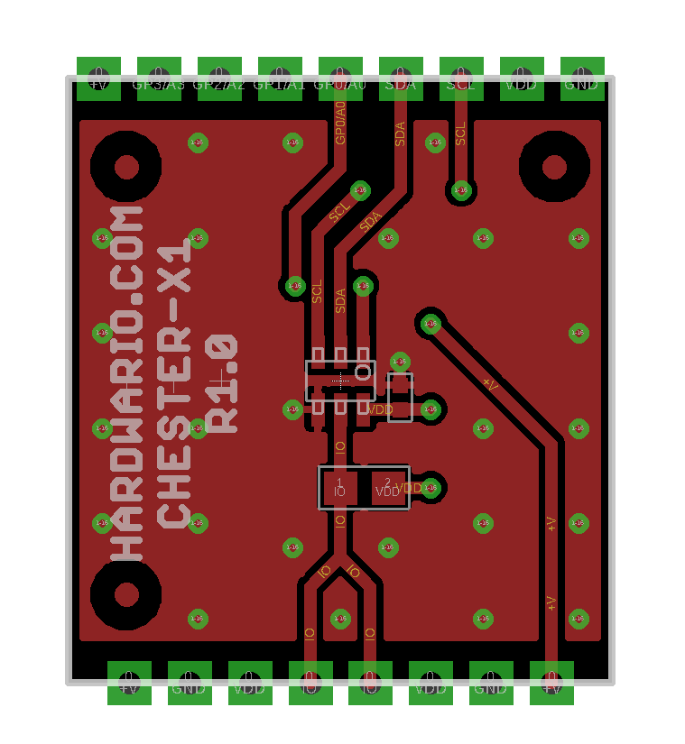
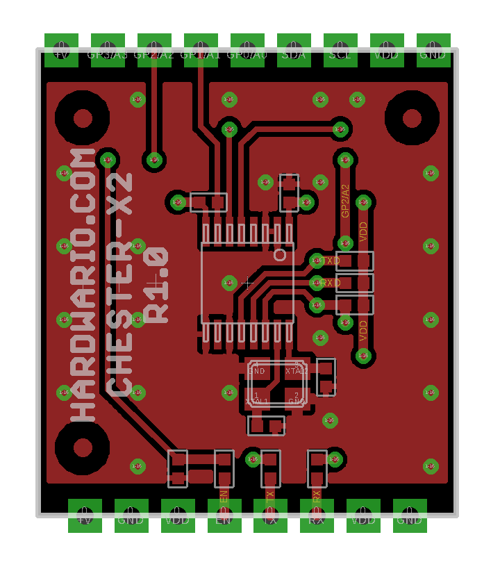
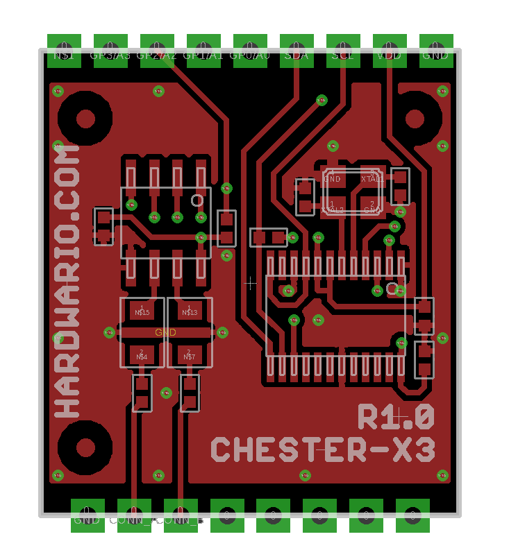
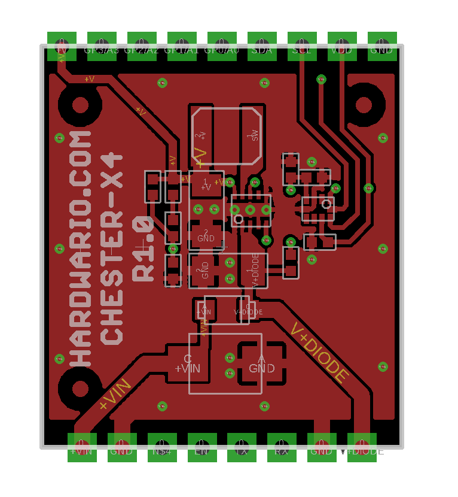
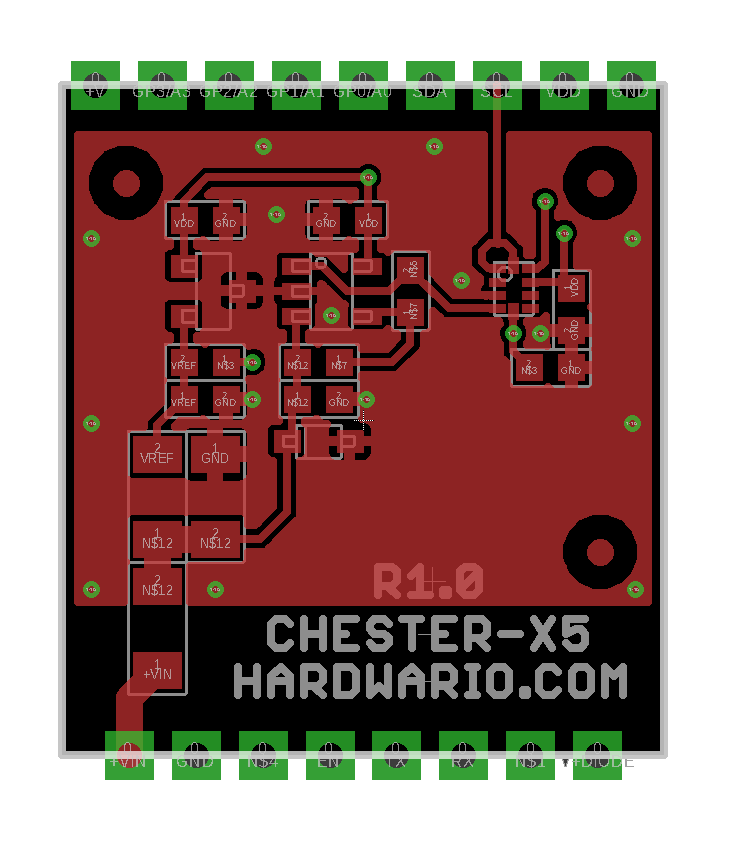

#################
Expansion Modules
#################

CHESTER is an extensible device throughout the expansion modules (up to two) installed underneath the bottom side of the board (underneath the battery).

**********
CHESTER-X1
**********

This module adds the 1-Wire interface.

.. list-table:: CHESTER-X1 pinout
   :widths: 10 10 80
   :header-rows: 1

   * - Terminal
     - Signal
     - Description
   * - x1
     - +V
     - Input voltage
   * - x2
     - GND
     - Sensor ground
   * - x3
     - VDD
     - Sensor power
   * - x4
     - IO
     - Sensor data
   * - x5
     - IO
     - Sensor data
   * - x6
     - VDD
     - Sensor power
   * - x7
     - GND
     - Sensor ground
   * - x8
     - +V
     - Input voltage

**********
CHESTER-X2
**********

This module adds the 3 V TTL UART interface.

.. list-table:: CHESTER-X2 pinout
   :widths: 10 10 80
   :header-rows: 1

   * - Terminal
     - Signal
     - Description
   * - x1
     - GND
     - Ground
   * - x2
     - VDD
     - 3 V power
   * - x3
     - RX
     - Input
   * - x4
     - TX
     - Output
   * - x5
     - EN
     - generic IO
   * - x6
     - VDD
     - 3 V power
   * - x7
     - GND
     - Ground
   * - x8
     - +V
     - Input voltage

**********
CHESTER-X3
**********

This module adds the RS-485 interface.

.. list-table:: CHESTER-X3 pinout
   :widths: 10 10 80
   :header-rows: 1

   * - Terminal
     - Signal
     - Description
   * - x6
     - B
     - RS-485 signal B
   * - x7
     - A
     - RS-485 signal A
   * - x8
     - GND
     - Ground

**********
CHESTER-X4
**********

This module adds the ability to power CHESTER from the external DC power supply. It integrates ultra-low-power DC/DC controller altogether with the ability to measure the input line voltage.

The operating input voltage ranges from 4 VDC to 28 V DC.

.. list-table:: CHESTER-X4 pinout
   :widths: 10 10 80
   :header-rows: 1

   * - Terminal
     - Signal
     - Description
   * - x1
     - V+DIODE
     - Unprotected input - DO NOT USE
   * - x2
     - GND
     - Ground
   * - x7
     - GND
     - Ground
   * - x8
     - +VIN
     - Input voltage 4 - 28 V DC

**********
CHESTER-X5
**********

This module adds the ability to measure external voltage in the range from -30 V to +30 V with the resolution of +/- 30 mV.

.. list-table:: CHESTER-X5 pinout
   :widths: 10 10 80
   :header-rows: 1

   * - Terminal
     - Signal
     - Description
   * - x7
     - GND
     - Ground
   * - x8
     - +VIN
     - Measured voltage -30 V to +30 V

